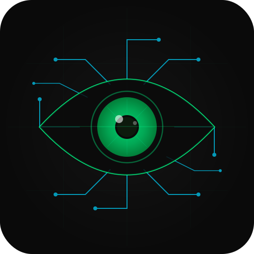

<div align="center">
  
  <h1>agentlens</h1>
  <p><strong>DevTools for AI agents — profile every call, find every bottleneck</strong></p>

  [](python/)
  [](typescript/)
  [](LICENSE)
  [](python/requirements.txt)

  [Website](https://speed785.github.io/agentlens) · [GitHub](https://github.com/speed785/agentlens) · [Issues](https://github.com/speed785/agentlens/issues)
</div>

---

```
  Call Trace — research-agent
  ────────────────────────────────────────────────────────────────────────────
  #   │Name                        │Type   │Model           │Latency (ms) │Tokens  │Status
  ────┼────────────────────────────┼───────┼────────────────┼─────────────┼────────┼──────────
  1   │research_pipeline           │chain  │—               │1243.2       │—       │✓ ok
  2   │plan_research               │llm    │gpt-4o          │612.4        │487     │✓ ok
  3   │web_search                  │tool   │—               │87.1         │—       │✓ ok
  4   │fetch_page                  │tool   │—               │134.5        │—       │✓ ok
  5   │fetch_page                  │tool   │—               │12.3         │—       │✗ ConnectionE…
  6   │summarize_text              │tool   │—               │18.9         │—       │✓ ok
  ────┴────────────────────────────┴───────┴────────────────┴─────────────┴────────┴──────────

  AgentLens — Profiler: research-agent
  ──────────────────────────────────────────────────
  Total calls:                   6
    LLM calls:                   1
    Tool calls:                  4
    Failed calls:                1
  Success rate:                  83.3%
  Total latency:                 865.2 ms
  Avg latency:                   144.2 ms
  ──────────────────────────────────────────────────
  Prompt tokens:                 312
  Completion tokens:             175
  Total tokens:                  487
```

---

## Why agentlens?

When your agent is slow or broken, you're usually staring at a wall of logs trying to figure out which of the 12 tool calls failed, which LLM call ate 3,000 tokens, and why the whole thing took 8 seconds. `print()` doesn't scale to multi-step pipelines.

agentlens wraps your calls with one decorator and gives you a structured trace: per-call latency, token accounting, error types, and named chains. No external service, no config file, no SDK lock-in.

## Features

- 🕐 **Per-call latency** — see exactly which step is slow, not just total wall time
- 🪙 **Token accounting** — prompt vs. completion tokens per LLM call, with pipeline totals
- ✗ **Failure tracking** — error types surfaced in the trace, not buried in a stack trace
- 🔗 **Call chains** — group related calls into named pipelines for clean hierarchical traces
- 📦 **Zero required dependencies** — works with any function that returns a value
- 🔌 **Drop-in SDK wrappers** — `ProfiledOpenAI` and `ProfiledAnthropic` need zero code changes
- 📤 **JSON export** — pipe traces to any logging system or replay them with `agentlens view`

## Quick Start

```bash
pip install agentlens

# With SDK integrations:
pip install agentlens[openai]       # OpenAI
pip install agentlens[anthropic]    # Anthropic
pip install agentlens[all]          # Both
```

```python
from agentlens import Profiler
from agentlens.reporter import Reporter

profiler = Profiler("my-agent")
reporter = Reporter(profiler)

@profiler.tool("web_search")
def web_search(query: str) -> list:
    ...

@profiler.llm(model="gpt-4o")
def call_gpt(messages: list):
    return openai_client.chat.completions.create(model="gpt-4o", messages=messages)

with profiler.chain("research_pipeline"):
    results = web_search("AI agent frameworks")
    response = call_gpt([{"role": "user", "content": "Summarize: " + str(results)}])

reporter.print_table()
reporter.print_summary()
reporter.export_json("trace.json")
```

## Usage

### Python

**Decorator API**

```python
from agentlens import Profiler
from agentlens.reporter import Reporter

profiler = Profiler("my-agent")

@profiler.tool("fetch_page")
def fetch_page(url: str) -> str:
    return requests.get(url).text

@profiler.llm(model="gpt-4o")
def summarize(messages: list):
    return openai_client.chat.completions.create(model="gpt-4o", messages=messages)

with profiler.chain("pipeline"):
    content = fetch_page("https://example.com")
    summary = summarize([{"role": "user", "content": content}])

Reporter(profiler).print_table()
```

**Manual instrumentation** (when decorators don't fit)

```python
call = profiler.start_call("custom_step", call_type="tool")
try:
    result = do_something()
    profiler.end_call(call, success=True)
except Exception as e:
    profiler.end_call(call, success=False, error=e)
```

### TypeScript

```bash
npm install agentlens
```

```typescript
import { Profiler, Reporter } from "agentlens";

const profiler = new Profiler("my-agent");

const searchWeb = profiler.wrapTool("search_web", async (query: string) => {
  return fetch(`https://api.search.com?q=${query}`).then(r => r.json());
});

const callGPT = profiler.wrapLLM("gpt-4o", async (messages) => {
  return openai.chat.completions.create({ model: "gpt-4o", messages });
}, { name: "plan_step" });

await profiler.runChain("research_pipeline", async () => {
  const results = await searchWeb("AI agent frameworks");
  return callGPT([{ role: "user", content: JSON.stringify(results) }]);
});

new Reporter(profiler).printTable();
```

**Manual instrumentation**

```typescript
const call = profiler.startCall("custom_step", "tool");
try {
  const result = await doSomething();
  profiler.endCall(call, { success: true });
} catch (err) {
  profiler.endCall(call, { success: false, error: err as Error });
}
```

## Integrations

### OpenAI (Python)

```python
import openai
from agentlens import Profiler
from agentlens.integrations.openai import ProfiledOpenAI

profiler = Profiler("gpt-agent")
client = ProfiledOpenAI(openai.OpenAI(api_key="..."), profiler=profiler)

# Identical to normal OpenAI usage — profiling is automatic
response = client.chat.completions.create(
    model="gpt-4o",
    messages=[{"role": "user", "content": "Hello!"}],
)
```

### Anthropic (Python)

```python
import anthropic
from agentlens import Profiler
from agentlens.integrations.anthropic import ProfiledAnthropic

profiler = Profiler("claude-agent")
client = ProfiledAnthropic(anthropic.Anthropic(api_key="..."), profiler=profiler)

message = client.messages.create(
    model="claude-opus-4-5",
    max_tokens=1024,
    messages=[{"role": "user", "content": "Hello!"}],
)
```

### OpenAI (TypeScript)

```typescript
import OpenAI from "openai";
import { Profiler } from "agentlens";
import { ProfiledOpenAI } from "agentlens/integrations/openai";

const profiler = new Profiler("gpt-agent");
const openai = new ProfiledOpenAI(new OpenAI({ apiKey: "..." }), profiler);

const res = await openai.chat.completions.create({
  model: "gpt-4o",
  messages: [{ role: "user", content: "Hello!" }],
});
```

### CLI Viewer

Replay any exported trace in the terminal:

```bash
agentlens view trace.json
agentlens view trace.json --timeline

# or
python -m agentlens view trace.json
```

## API Reference

### `Profiler`

| Method | Description |
|--------|-------------|
| `Profiler(name, tags?)` | Create a profiler instance |
| `.tool(name?, tags?)` | Decorator for tool functions |
| `.llm(model?, name?, tags?)` | Decorator for LLM calls |
| `.chain(name)` | Context manager to group calls into a named pipeline |
| `.start_call(name, call_type, model?)` | Manual: start a call |
| `.end_call(call, success, error?, token_usage?)` | Manual: finish a call |
| `.calls` | List of all `ProfiledCall` objects |
| `.summary()` | Dict of aggregate stats |
| `.get_calls(call_type?, success_only?, failed_only?)` | Filtered call list |
| `.clear()` | Reset recorded calls |

### `Reporter`

| Method | Description |
|--------|-------------|
| `Reporter(profiler)` | Create a reporter |
| `.print_table()` | Print a detailed call table |
| `.print_summary()` | Print aggregate statistics |
| `.print_timeline()` | Print ASCII latency timeline |
| `.export_json(path)` | Export full trace as JSON |

## Contributing

PRs welcome. To get started:

```bash
git clone https://github.com/speed785/agentlens
cd agentlens

# Python
cd python && pip install -e ".[dev]"

# TypeScript
cd typescript && npm install && npm run build
```

Open an issue first for anything beyond a small fix.

## License

MIT — see [LICENSE](LICENSE).
